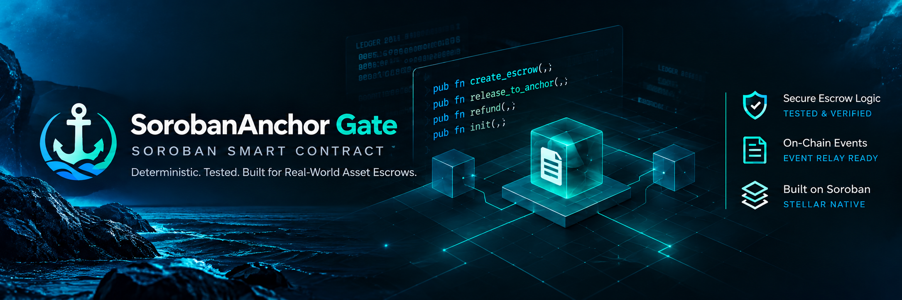

<div align="center">



# SorobanAnchor Gate Contract

Soroban milestone escrow smart contract for secure token custody, anchor release, and timelocked refunds on Stellar.

[](https://github.com/Sorobo-Gate/soroban-anchor-gate-contract/actions/workflows/ci.yml)
[](LICENSE)
[](https://github.com/Sorobo-Gate/soroban-anchor-gate-contract/releases/tag/v0.1.1)
[](https://stellar.expert/explorer/testnet/contract/CBIHLECKLMXYK6FPHSGGVYF6AHNFRHR3T5EIFIS3PFQDFKDQWNR25PHT)
[](src/test.rs)

[App Monorepo](https://github.com/Sorobo-Gate/soroban-anchor-gate-app) • [Testnet Explorer](https://stellar.expert/explorer/testnet/contract/CBIHLECKLMXYK6FPHSGGVYF6AHNFRHR3T5EIFIS3PFQDFKDQWNR25PHT) • [Evidence Index](evidence/index.md) • [Security](SECURITY.md) • [Contributing](CONTRIBUTING.md)

</div>

---

## What is SorobanAnchor Gate Contract?

`soroban-anchor-gate-contract` is an open-source milestone escrow smart contract built for the Stellar network using the Soroban SDK. It provides non-custodial custody of Stellar Asset Contract (SAC) tokens, programmatic timelocked release to Stellar Anchor disbursement accounts, and deterministic refund paths for depositors if milestones expire unfulfilled.

---

## Why it exists

When parties transact across traditional banking rails and decentralized ledgers, coordinating escrow release requires separating custody from banking settlement:

- **Trustless Custody**: Depositors need guarantees that funds cannot be arbitrarily seized, diverted to unapproved accounts, or locked indefinitely without a refund mechanism.
- **Privacy Preservation**: Banking coordinates (IBANs, routing numbers, account identifiers) should never be exposed on public ledgers.
- **Deterministic Settlement**: Protocol fees must be capped, mathematically verified, and atomically routed to a designated treasury without rounding vulnerabilities.

SorobanAnchor Gate addresses this challenge by custodying tokens onchain while anchoring off-chain banking metadata via a 32-byte SHA-256 cryptographic commitment (`profile_hash`). Upon authorized release, the contract atomically distributes protocol fees and emits an onchain event that off-chain relayers use to route fiat disbursements.

---

## Contract lifecycle

The smart contract implements a deterministic three-state lifecycle:

```text
               [ create_escrow() ]
                        │
                        ▼
               ┌─────────────────┐
               │     FUNDED      │
               └────────┬────────┘
                        │
       ┌────────────────┴────────────────┐
       │                                 │
[ release_to_anchor() ]           [ refund() ]
       │                                 │
       ▼                                 ▼
┌──────────────┐                 ┌───────────────┐
│  DISBURSED   │                 │   REFUNDED    │
└──────────────┘                 └───────────────┘
```

1. **`init`**: Configures governance admin, fee treasury destination, and basis-point protocol fee (capped at 1,000 bps / 10.00%).
2. **`create_escrow`**: Payer locks tokens, binds a 32-byte `profile_hash` commitment, and specifies lock duration. Contract transitions to `Funded`.
3. **`release_to_anchor`**: Authorized by either the original payer or protocol admin. Protocol fee is routed to treasury; net balance is sent to the anchor disbursement address. Contract transitions to terminal `Disbursed`.
4. **`refund`**: Authorized strictly by the original payer after ledger timestamp exceeds `unlock_timestamp`. 100% of deposited tokens are returned. Contract transitions to terminal `Refunded`.

---

## Authorization model

Every state-mutating host invocation requires cryptographic authority verified through Soroban's `require_auth()` mechanism:

| Function | Required Caller | Auth Check | Access Control Defense |
| --- | --- | --- | --- |
| `init` | Protocol Admin | `admin.require_auth()` | Rejects duplicate initialization if admin storage key is present. |
| `create_escrow` | Milestone Payer | `payer.require_auth()` | Direct SAC debit from caller account into contract custody. |
| `release_to_anchor` | Payer OR Admin | `caller.require_auth()` | Rejects any caller other than recorded `payer` or governance `admin`. |
| `refund` | Original Payer | `record.payer.require_auth()` | Enforces `caller == payer` and `ledger.timestamp >= unlock_timestamp`. |

---

## Verified Testnet deployment

The smart contract is deployed and verified live on Stellar Testnet:

| Parameter | Observed Value |
| --- | --- |
| **Network** | Stellar Testnet (`Test SDF Network ; September 2015`) |
| **Soroban RPC** | `https://soroban-testnet.stellar.org` |
| **Protocol Version** | 29 (Captive Core 29.0.0) |
| **Deployed Contract ID** | [`CBIHLECKLMXYK6FPHSGGVYF6AHNFRHR3T5EIFIS3PFQDFKDQWNR25PHT`](https://stellar.expert/explorer/testnet/contract/CBIHLECKLMXYK6FPHSGGVYF6AHNFRHR3T5EIFIS3PFQDFKDQWNR25PHT) |
| **WASM Hash** | `ba9eaef277a2943c5a48f38aea849c78acf8cd9306d71646225a15ea41965e32` |
| **Target Build** | `wasm32v1-none` (7,515 bytes optimized) |
| **Contract Release** | `v0.1.1` |
| **Deployer / Admin Address** | `GAC6AIE7NVRD5FKLZZXLFNBZKCF4E5PETYC2O2MNHDP2CL5Z2C4KZUBW` |
| **Native SAC Token Address** | `CDLZFC3SYJYDZT7K67VZ75HPJVIEUVNIXF47ZG2FB2RMQQVU2HHGCYSC` |

Live transaction execution records and event logs are documented in [`evidence/testnet-2026-10-06.md`](evidence/testnet-2026-10-06.md).

---

## Contract interface

### Public Functions

#### `init(env: Env, admin: Address, treasury: Address, fee_bps: u32) -> Result<(), EscrowError>`
Initializes the protocol configuration. Enforces `admin.require_auth()`. Fails with `AlreadyInitialized` (2) if previously called, or `InvalidBps` (9) if `fee_bps > 1000`.

#### `create_escrow(env: Env, payer: Address, beneficiary: Address, token: Address, amount: i128, profile_hash: BytesN<32>, lock_duration: u64) -> Result<u64, EscrowError>`
Locks `amount` tokens from `payer`, increments sequential counter, writes `EscrowRecord` to persistent storage, and extends instance/persistent TTL. Fails with `ZeroAmount` (8) if `amount <= 0`.

#### `release_to_anchor(env: Env, escrow_id: u64, caller: Address, anchor_disbursement_address: Address) -> Result<(), EscrowError>`
Validates that `caller` is recorded payer or protocol admin. Deducts protocol fee to treasury and transfers remaining amount to `anchor_disbursement_address`. Transitions state to `Disbursed`.

#### `refund(env: Env, escrow_id: u64) -> Result<(), EscrowError>`
Verifies that caller is recorded `payer` and that `env.ledger().timestamp() >= record.unlock_timestamp`. Transfers 100% of deposited tokens back to payer. Transitions state to `Refunded`.

---

## Events

The contract emits standardized Soroban events for all state transitions:

| Event Topic | Event Payload | Description |
| --- | --- | --- |
| `("created", escrow_id: u64)` | `(payer: Address, amount: i128, profile_hash: BytesN<32>)` | Emitted when an escrow is funded and registered. |
| `("disbursed", escrow_id: u64)` | `(profile_hash: BytesN<32>, payout_amount: i128)` | Emitted when funds are disbursed to the anchor. Observed by off-chain relay. |
| `("refunded", escrow_id: u64)` | `amount: i128` | Emitted when principal is returned to depositor. |

---

## Verification

The contract's behavior is verified through automated test suites and onchain transactions:

- **21 Automated Cargo Tests**: 100% pass rate in `src/test.rs`, covering initialization, authorization boundaries, fee math bounds, timelock edges, duplicate call prevention, overflow protection, and event schemas.
- **Clean Toolchain Compliance**: Verified with `cargo fmt --check`, `cargo check`, and `cargo clippy --all-targets -- -D warnings`.
- **Live Testnet Execution**: Complete lifecycle verified on Testnet, including initialization ([`1ee57cf0...`](https://stellar.expert/explorer/testnet/tx/1ee57cf0d72c32d51ee102a038144c6d395a5e38b31b5b4c8afc600cfaa7c079)), duplicate init rejection, creation ([`e0b57482...`](https://stellar.expert/explorer/testnet/tx/e0b574823c2c8bd9e8b9e97ae561c69e536fc38b6f61a21553d1f6e27e75980d)), anchor disbursement with 2% fee split ([`0acc0aa6...`](https://stellar.expert/explorer/testnet/tx/0acc0aa60858bc579fb774ef4ea4788ec62c47db6c9ed4524f8b0cd77436dbeb)), and timelocked refund ([`9f1cf6f0...`](https://stellar.expert/explorer/testnet/tx/9f1cf6f0f93db563de4b9d1a4daad34861c27ae8036486a525ba92b6df889f03)).

---

## Build and test

### Prerequisites
- Rust stable 1.85+ (tested on `1.97.1`)
- WebAssembly target: `wasm32v1-none`
- Stellar CLI version `28.1.0` or higher

```bash
# Add WebAssembly compilation target
rustup target add wasm32v1-none

# Verify toolchains
rustc --version
stellar --version
```

### Build Optimized Bytecode
```bash
stellar contract build
```
The optimized WebAssembly binary is generated at:
`target/wasm32v1-none/release/soroban_anchor_escrow.wasm`

### Run Verification Checks
```bash
# Check code formatting
cargo fmt --check

# Compiler check
cargo check

# Strict linter check
cargo clippy --all-targets -- -D warnings

# Execute full 21-test verification suite
cargo test
```

---

## Security boundaries

- **Non-Custodial**: Protocol operations never access private keys. Users sign all contract calls directly using supported Stellar wallets.
- **Integer Arithmetic Safety**: All fee calculations and balance operations use checked arithmetic (`checked_mul`, `checked_sub`, `checked_add`) to prevent arithmetic overflow vulnerabilities.
- **Storage TTL Auto-Extension**: Instance and persistent entries extend their storage lifetime automatically during state-mutating operations to prevent accidental ledger expiration.
- **No Third-Party Audit**: The smart contract has **not** completed an external third-party security audit. Deployments are currently restricted to Stellar Testnet.

For vulnerability disclosure guidelines, see [`SECURITY.md`](SECURITY.md).

---

## Limitations

- **Unrestricted SAC Acceptance / No Administrative Token Whitelist**: The current contract accepts any valid SAC token address specified by the depositor. An administrative multi-token whitelist is planned in [Issue #1](https://github.com/Sorobo-Gate/soroban-anchor-gate-contract/issues/1).
- **Binary Settlement**: Escrows resolve completely to disbursement or completely to refund. An arbiter dispute resolution branch for fractional allocations is planned in [Issue #2](https://github.com/Sorobo-Gate/soroban-anchor-gate-contract/issues/2).
- **Anchor Off-Chain Fulfillment**: The contract cannot verify whether an off-chain anchor honors fiat payout once funds are transferred to its distribution address.

---

## Related app repository

The companion monorepo is located at [`Sorobo-Gate/soroban-anchor-gate-app`](https://github.com/Sorobo-Gate/soroban-anchor-gate-app).

### Implemented App Capabilities:
- Next.js 16 web interface with Freighter browser wallet connection (`apps/web`).
- TypeScript contract client SDK wrapping Soroban parameter encoders and integer-safe math (`packages/contract-client`).
- Go event listener daemon polling Soroban RPC for `disbursed` events with durable file storage (`services/relay`).
- Live Testnet interactive escrow creation verified onchain.

### Known Limitation / Planned Work in App:
- Programmatic SEP-10 challenge authentication with partner anchors ([Issue #1](https://github.com/Sorobo-Gate/soroban-anchor-gate-app/issues/1)).
- Live SEP-31 anchor payment dispatch to off-chain banking rails.

---

## Contributing

Please review [`CONTRIBUTING.md`](CONTRIBUTING.md) for contribution guidelines, conventional commit standards, selective staging requirements, and pull request procedures. All active PRs must target the `develop` branch.

---

## Roadmap

- [ ] Administrative multi-token whitelist storage ([Issue #1](https://github.com/Sorobo-Gate/soroban-anchor-gate-contract/issues/1))
- [ ] Arbiter-mediated fractional dispute resolution ([Issue #2](https://github.com/Sorobo-Gate/soroban-anchor-gate-contract/issues/2))
- [ ] Third-party external smart contract security audit
- [ ] Stellar Mainnet deployment readiness review

---

## License

Distributed under the Apache 2.0 License. See [`LICENSE`](LICENSE) for details.