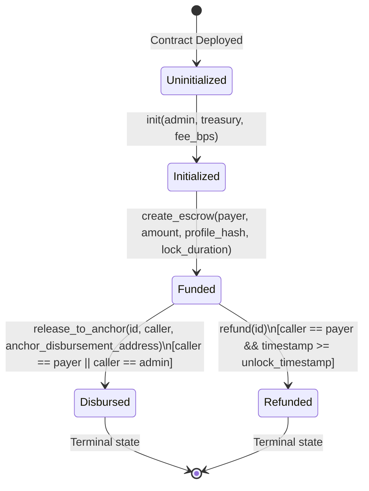

# Smart Contract Specification: `EscrowGate`

**Target Contract:** `EscrowGate`  
**Crate:** `soroban-anchor-escrow`  
**Authoritative Source:** [`src/lib.rs`](file:///home/gamp/drips/soroban-anchor-gate-contract/src/lib.rs)  
**WASM Target:** `wasm32v1-none` (Stellar Protocol 22–29 compatible)

---

## 1. Public Function Surface

| Function | Caller | Auth Requirement | Arguments | Return Type | Storage Reads | Storage Mutations | Events Emitted | Failure Cases (Error Codes) | User-Flow Purpose |
|---|---|---|---|---|---|---|---|---|---|
| `init` | Deployer / Contract Admin | `admin.require_auth()` | `env: Env`<br>`admin: Address`<br>`treasury: Address`<br>`fee_bps: u32` | `Result<(), EscrowError>` | `DataKey::Admin` (checks existence) | Sets:<br>• `DataKey::Admin`<br>• `DataKey::Treasury`<br>• `DataKey::FeeBps`<br>• `DataKey::EscrowCounter = 0`<br>Extends instance TTL | None | • `AlreadyInitialized` (2) if admin key already set<br>• `InvalidBps` (9) if `fee_bps > 1000` (max 10.00%) | Bootstraps global protocol governance, treasury destination, protocol fee cap, and counter. |
| `create_escrow` | Milestone Depositor / Payer | `payer.require_auth()` | `env: Env`<br>`payer: Address`<br>`beneficiary: Address`<br>`token: Address`<br>`amount: i128`<br>`profile_hash: BytesN<32>`<br>`lock_duration: u64` | `Result<u64, EscrowError>` | `DataKey::EscrowCounter` | Mutates:<br>• `DataKey::EscrowCounter` (+1)<br>Writes:<br>• `DataKey::Escrow(counter)` (`Funded`)<br>Extends persistent & instance TTL | `("created", counter)` -> `(payer, amount, profile_hash)` | • `ZeroAmount` (8) if `amount <= 0`<br>• `NotInitialized` (1) if contract uninitialized<br>• `InvalidStatus` (5) if counter or timestamp overflows | Locks principal in SAC token contract custody, generates deterministic sequential escrow ID, binds 32-byte off-chain routing hash, and establishes unlock timer. |
| `release_to_anchor` | Milestone Payer OR Admin | `caller.require_auth()` (`caller == payer \|\| caller == admin`) | `env: Env`<br>`escrow_id: u64`<br>`caller: Address`<br>`anchor_disbursement_address: Address` | `Result<(), EscrowError>` | `DataKey::Admin`<br>`DataKey::Escrow(id)`<br>`DataKey::FeeBps`<br>`DataKey::Treasury` | Mutates:<br>• `DataKey::Escrow(id)` (`Disbursed`)<br>Extends instance TTL | `("disbursed", escrow_id)` -> `(profile_hash, payout_amount)` | • `Unauthorized` (3) if caller != payer and caller != admin<br>• `NotInitialized` (1) if admin/treasury missing<br>• `EscrowNotFound` (4) if id does not exist<br>• `InvalidStatus` (5) if status != `Funded` or arithmetic overflows | Deducts protocol fee (if > 0) to treasury, transfers net balance to specified anchor distribution address, marks escrow `Disbursed`, and emits relay event. |
| `refund` | Original Escrow Payer | `record.payer.require_auth()` | `env: Env`<br>`escrow_id: u64` | `Result<(), EscrowError>` | `DataKey::Escrow(id)` | Mutates:<br>• `DataKey::Escrow(id)` (`Refunded`)<br>Extends instance TTL | `("refunded", escrow_id)` -> `record.amount` | • `EscrowNotFound` (4) if id does not exist<br>• `InvalidStatus` (5) if status != `Funded`<br>• `UnlockTimeNotReached` (6) if `ledger.timestamp < unlock_timestamp` | Returns 100% of deposited principal back to payer when lock duration expires without release. |

---

## 2. Onchain State Variants & Types

### `EscrowStatus`
```rust
#[contracttype]
#[derive(Clone, Debug, Eq, PartialEq)]
pub enum EscrowStatus {
    Funded,    // Initial state: principal locked in contract custody
    Disbursed, // Terminal state: payout sent to anchor address; fee sent to treasury
    Refunded,  // Terminal state: 100% principal returned to depositor
}
```

### `EscrowRecord` (Persistent Storage Value)
```rust
#[contracttype]
#[derive(Clone, Debug, Eq, PartialEq)]
pub struct EscrowRecord {
    pub payer: Address,             // Depositor entity with disbursement and refund authorization
    pub beneficiary: Address,       // Destination contractor/vendor account identity
    pub token: Address,             // Stellar Asset Contract (SAC) token address (e.g. USDC)
    pub amount: i128,               // Locked principal amount in token base units
    pub profile_hash: BytesN<32>,   // SHA-256 hash of off-chain recipient banking coordinates
    pub status: EscrowStatus,       // State machine status: Funded -> Disbursed | Refunded
    pub unlock_timestamp: u64,      // Absolute unix ledger timestamp at/after which refund is valid
}
```

### `DataKey` (Storage Namespace)
```rust
#[contracttype]
#[derive(Clone)]
pub enum DataKey {
    Admin,           // Instance storage: protocol administrator Address
    Treasury,        // Instance storage: protocol fee recipient Address
    FeeBps,          // Instance storage: protocol fee in basis points (u32, <= 1000)
    EscrowCounter,   // Instance storage: sequential counter of escrows (u64)
    Escrow(u64),     // Persistent storage: mapped to EscrowRecord
}
```

---

## 3. Protocol Error Codes & Handlers

| Error Identifier | Code | Trigger Condition | Status / Intended Protocol Role |
|---|---|---|---|
| `NotInitialized` | `1` | Invoking `create_escrow` or `release_to_anchor` before `init` has executed. | Active MVP enforcement. |
| `AlreadyInitialized` | `2` | Invoking `init` when `DataKey::Admin` already exists in instance storage. | Active MVP enforcement. |
| `Unauthorized` | `3` | Calling `release_to_anchor` when caller is neither the recorded `payer` nor the contract `admin`. | Active MVP enforcement. |
| `EscrowNotFound` | `4` | Referencing an `escrow_id` that does not exist in persistent storage. | Active MVP enforcement. |
| `InvalidStatus` | `5` | Attempting to release or refund an escrow not in `Funded` status (prevents double release / double refund). | Active MVP enforcement. |
| `UnlockTimeNotReached` | `6` | Attempting `refund` when current ledger timestamp is strictly less than `record.unlock_timestamp`. | Active MVP enforcement. |
| `UnlockTimePassed` | `7` | Reserved error code: Defined in enum for future dispute mediation workflows (Issue #2). Currently unraised in MVP flow because payer and admin retain release authorization even after timelock. | Reserved for future backlog (Issue #2). |
| `ZeroAmount` | `8` | Attempting `create_escrow` with `amount <= 0`. | Active MVP enforcement. |
| `InvalidBps` | `9` | Attempting `init` with `fee_bps > 1000` (exceeding the 10.00% protocol fee ceiling). | Active MVP enforcement. |
| `ArithmeticOverflow` | `10` | Checked arithmetic failure during counter increment, timelock addition, fee calculation, or payout subtraction. | Active MVP enforcement. |

---

## 4. State Transition Diagram



---

## 5. Security & Boundary Architecture

### A. Initialization & Governance
- `init` can only be invoked once. It enforces `admin.require_auth()`.
- Maximum fee bound: `fee_bps <= 1000` (10%). `fee_amount = (amount * fee_bps) / 10,000`.

### B. Authorization Boundaries
- `create_escrow`: Strictly requires `payer.require_auth()`. Tokens are pulled directly from payer via SAC `transfer(&payer, &contract, &amount)`.
- `release_to_anchor`: Enforces `caller.require_auth()`, where `caller == record.payer || caller == admin`. Third-party addresses cannot disburse funds.
- `refund`: Strictly requires `record.payer.require_auth()`. Only the original payer can trigger refund, and only after `unlock_timestamp`.

### C. Anchor Disbursement Address Trust Boundary
- The `anchor_disbursement_address` is passed at execution time by the authorized caller (payer or admin).
- Payout funds are transferred directly from the contract address to `anchor_disbursement_address`.
- The smart contract does not perform off-chain HTTP lookups; the Anchor Gateway Daemon receives the `disbursed` event, matches the `profile_hash`, and coordinates local off-chain fiat settlement.

### D. Storage TTL Policy
- **Persistent Storage (`DataKey::Escrow(counter)`):** Threshold = 100,000 ledgers (~5.7 days); Amount = 200,000 ledgers (~11.5 days). Extended on creation.
- **Instance Storage (`DataKey::Admin`, `Treasury`, `FeeBps`, `EscrowCounter`):** Extended on `init`, `create_escrow`, `release_to_anchor`, and `refund` to ensure perpetual instance availability.
